<!--
 * @Author: txd
 * @Date: 2024-04-17 08:52:37
 * @LastEditors: Do not edit
 * @LastEditTime: 2024-04-19 09:54:14
 * @FilePath: \doc\使用说明.md
-->
<!--
 * @Author: txd
 * @Date: 2024-04-15 15:33:08
 * @LastEditors: Do not edit
 * @LastEditTime: 2024-04-16 16:40:00
 * @FilePath: \fuzhengwei.github.io\README.md
-->

    <a href="#" style="font-size:30px">商户管理系统</a>

# 本地项目文档说明

> 本项目是主要是用来管理设备，管理用户，查看用户消费记录，充值记录，设备的使用情况。

## 新用户使用

### 登录

.
`（所有图片点击可放大）`

### 创建项目

> 新用户没有项目需要创建项目才可以使用，需要先创建项目。点击创建项目+，填写相关信息提交即可

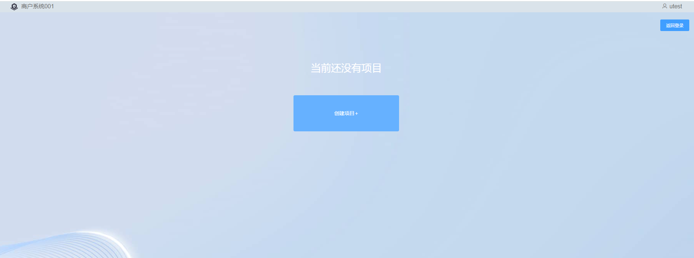

<!-- **登陆创建项目** -->

## 已有项目使用

> 老用户就不演示登录了，登录成功进入选择项目页面。页面最多显示 12 个项目。但是在搜索框中可以模糊查询项目，点击项目进入首页

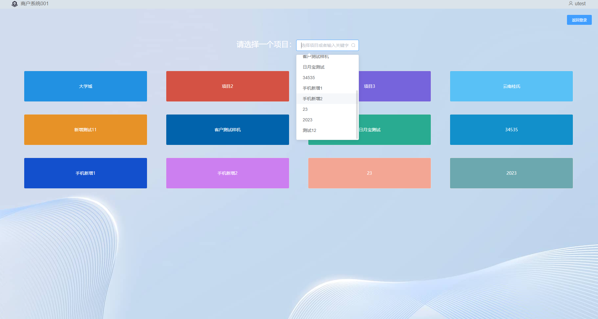

### 创建项目

> 如果你想创建更多的项目，可以在左侧菜单栏中，选择项目中心->项目列表->新增，并填写相关信息提交即可

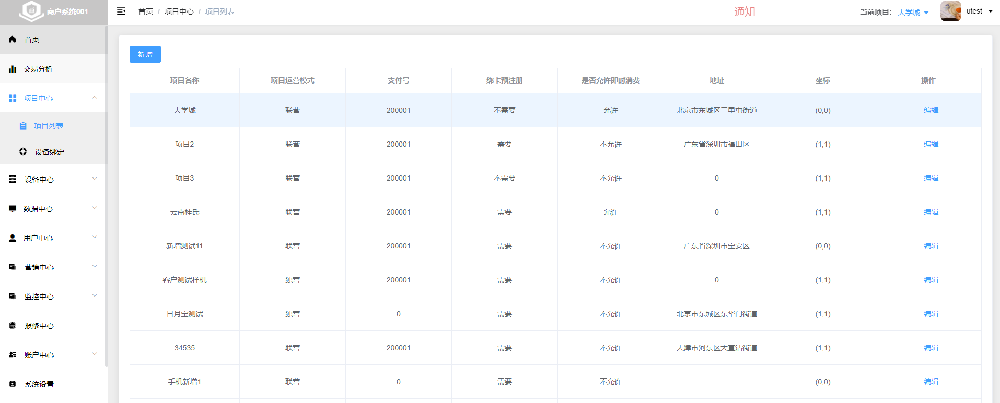

## 设备绑定解绑

> 1.设备绑定分为`批量设备绑定、解绑`和`单设备绑定、解绑`。 
> 2.单设备绑定或解绑，`方式1`：在批量设备绑定解绑中搜索出该设备再进行操作。`方式2`：已绑定的设备，也可以在`设备管理列表`中，查询到该设备，点击列表中`解绑`按钮。点击列表中`编辑`按钮，选择`修改设备项目绑定`按钮,可换绑到其他项目。 
> 3.批量设备绑定、解绑，在`设备绑定页面`，可选择`批量绑定`或`批量解绑`,批量选择左边设备，点击中间穿梭按钮，将需要绑定的设备移动到右边，然后选择需要绑定到的项目（解绑不需选择），最后点击右下角提交按钮即可。 

### 设备批量操作

#### 批量绑定

> 1.在左侧菜单栏中，选择项目中心->设备绑定->批量绑定 
> 2.选择左边设备，点击中间穿梭按钮，将需要绑定的设备移动到右边，然后`选择需要绑定到的项目`，最后点击右下角`提交`按钮即可。 
> 3.在左边设备列表上方`搜索框`中，输入需要搜索设备`信息片段`，可进行模糊搜索设备（可实现`精准单设备`绑定）。

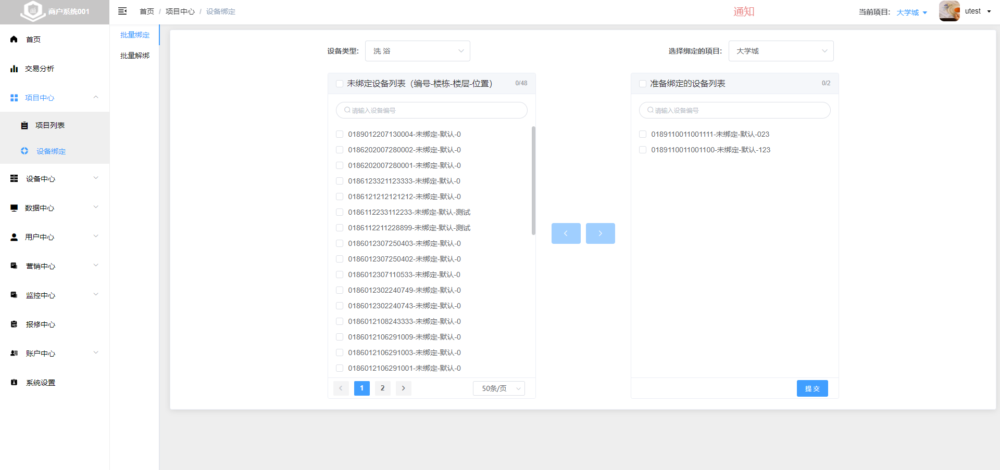

#### 批量解绑

> 1.在左侧菜单栏中，选择项目中心->设备绑定->批量解绑 
> 2.选择左边设备，点击中间穿梭按钮，将需要绑定的设备移动到右边，然后`选择需要绑定到的项目`，最后点击右下角`提交`按钮即可。 
> 3.在左边设备列表上方`搜索框`中，输入需要搜索设备`信息片段`，可进行模糊搜索设备（可实现`精准单设备`解绑）。

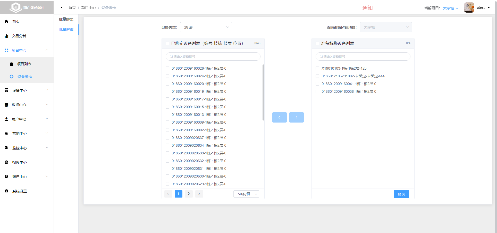

#### 失败提示

> 在提交`批量解绑`或`批量绑定`的过程中，有些设备`绑定失败`或`解绑失败`。全部提交完成会弹出失败的设备列表，点击失败设备的`设备编号`，会出现错误的原因。失误点击关闭弹窗后，点击`查看失败列表`按钮，可以重新查看失败的设备情况。

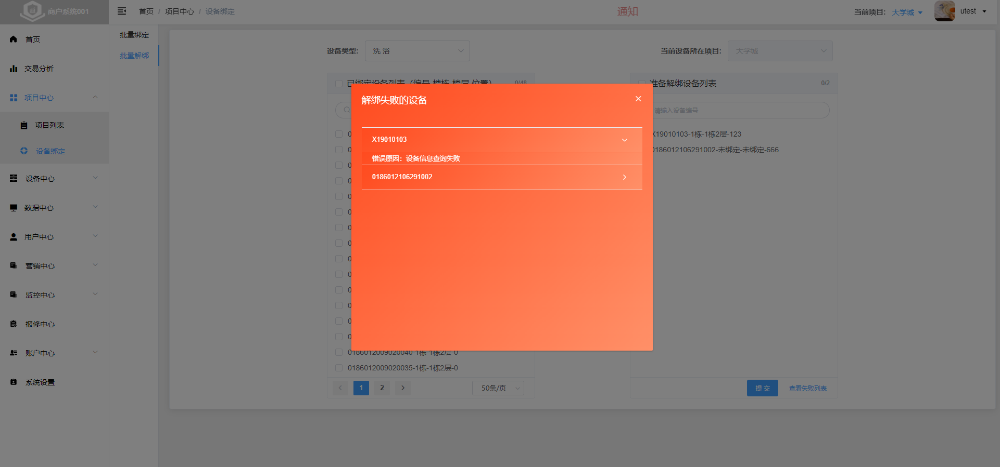

### 单个设备

> 1.在左侧菜单栏中，选择设备中心->设备管理->选择全部或者单设备类型进入设备列表页面。 
2.单个`设备解绑`,在`设备管理列表`中，查询你要操作的设备，点击列表中`解绑`按钮可解绑。 
3.单个`设备换绑`,在`设备管理列表`中，查询你要操作的设备，点击列表中`编辑`按钮，选择`修改设备项目绑定`按钮,可换绑到其他项目。 

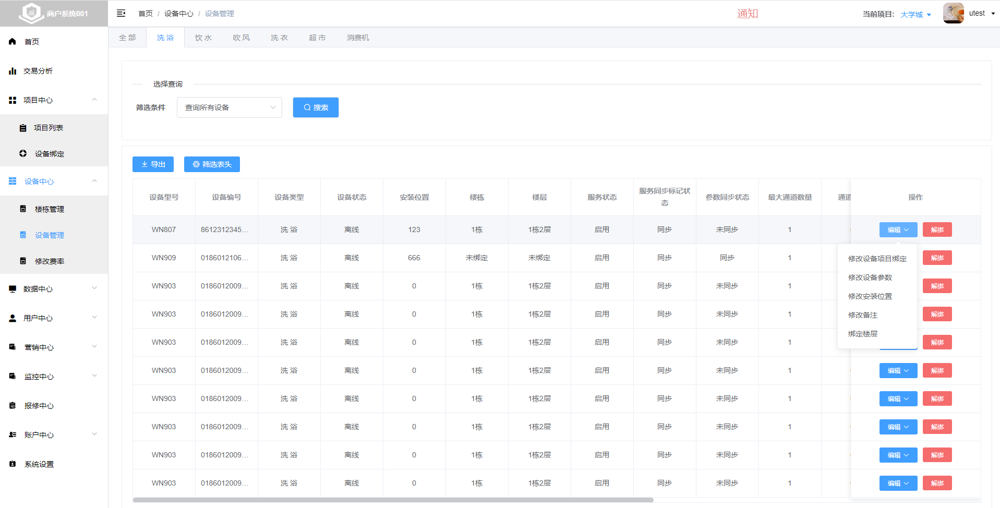

## 设备费率

> 1.在左侧菜单栏中，选择设备中心->修改费率。费率分为`水控费率`和`洗衣机费率` 
> 2.水控费率,在水控费率页面中有`修改费率`，还有水控费率`产品列表`。`产品列表`就是一个产品对应一种费率，可自行添加或编辑产品。在修改费率页面中，在`费率方案`中选择产品，便自动配置该产品的费率。 
> 3.水控费率修改方式，可划分`批量修改`和`单个修改`。`批量修改`可选择型号、项目、楼栋位置下的设备，也可以上传excel文件批量设备修改。`单个修改`选择单个设备，并搜索该设备费率参数，修改设备费率。 
>4.`洗衣机费率`需要在`设备管理`中选择洗衣机、洗鞋、烘干设备下，点击`编辑`按钮，选择设备参数，即可选择修改对应的`洗衣机费率产品`。`洗衣机费率产品`在修改费率中的洗衣机费率页产品列表面中。可添加修改洗衣机费率产品以及产品的费率。

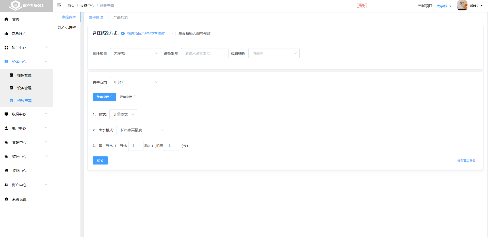

### 水控费率
>水控费率修改中有`修改费率`，还有水控费率`产品列表`。`产品列表`就是一个产品对应一种费率，可自行添加或编辑产品。在修改费率页面中，在`费率方案`中选择产品，便自动配置该产品的费率。

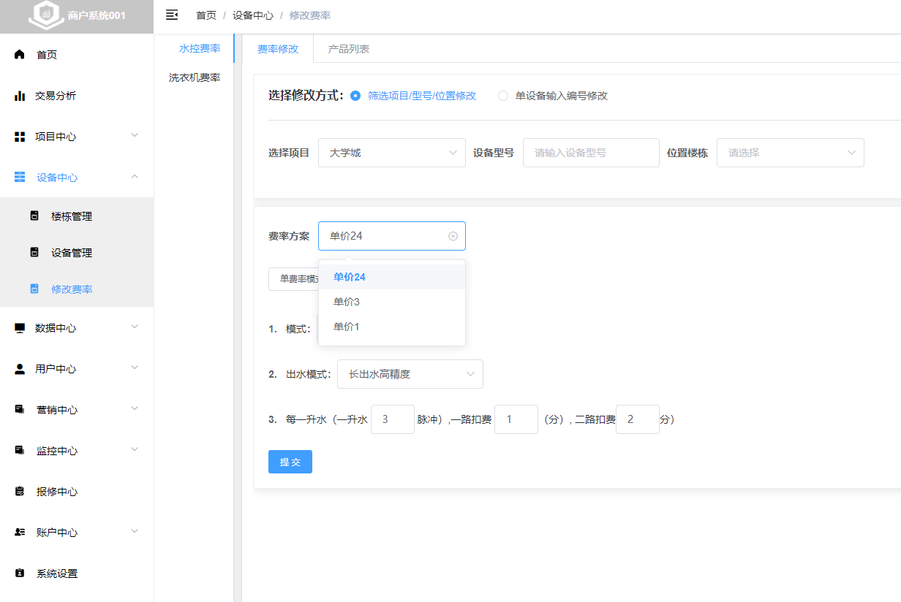

>水控费率产品，在水控费率中的产品列表。可以新增产品，也可以修改产品的费率

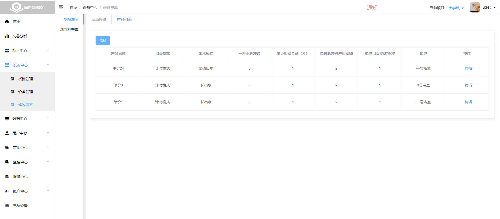

### 洗衣机费率
>1.洗衣机费率，也是一种产品、每个产品中的参数就是对应的费率， 
>2.洗衣机的费率在设备中心->设备管理->可以修改费率的设备类型有`洗衣机`、烘干机、`洗鞋` 
>3.点击`编辑`按钮，选择设备参数，即可选择修改对应的`洗衣机费率产品`,就可以用绑定洗衣机的费率产品

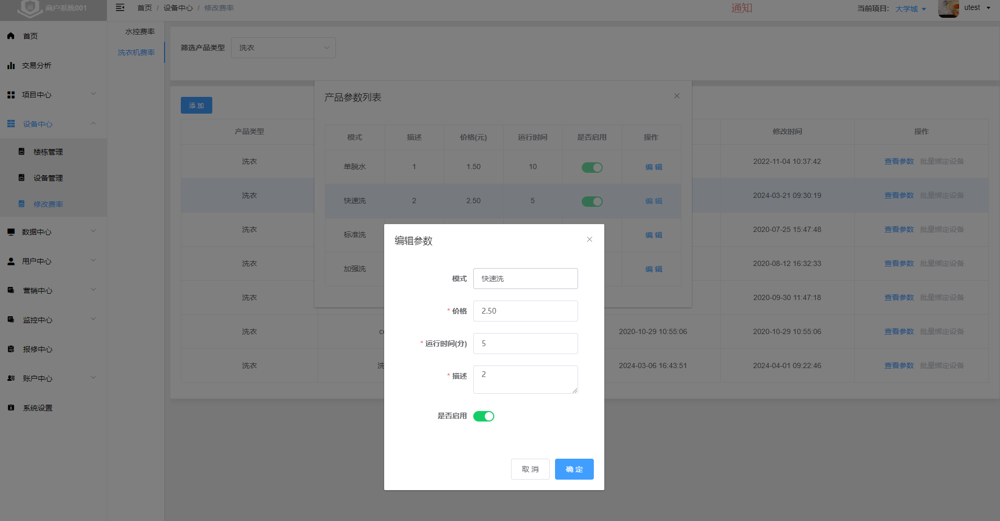
